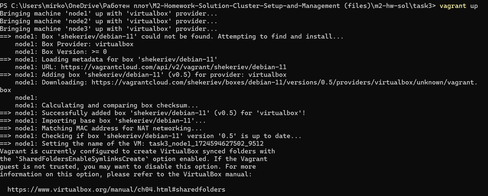
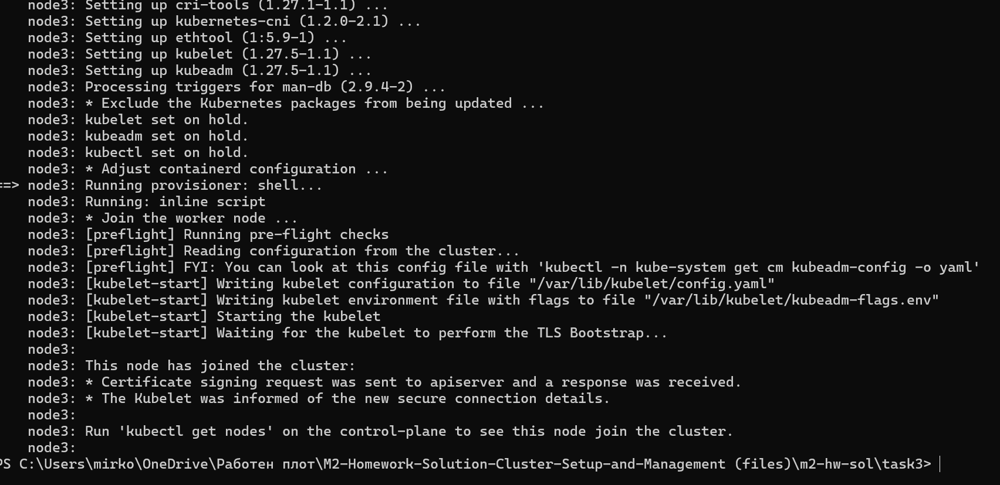
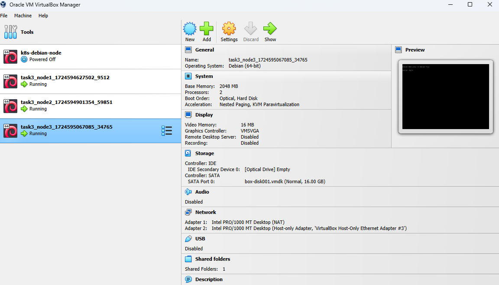
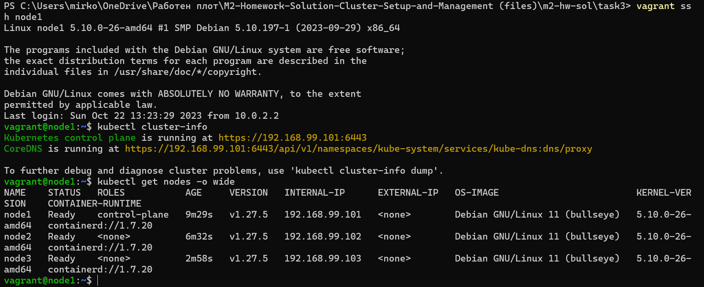
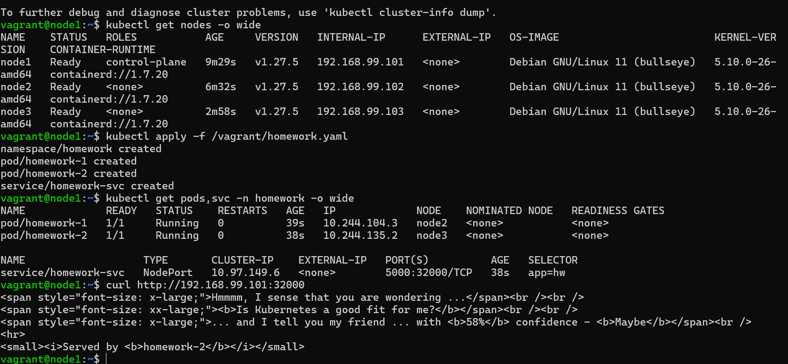

## Create a three-node vanilla Kubernetes cluster in a virtualization solution of your choice. You are free to use Debian (as demonstrated during the practice) or any other (from the same or another family) Linux distribution. Use Vagrant or a similar tool to do it in as much automated fashion as possible

